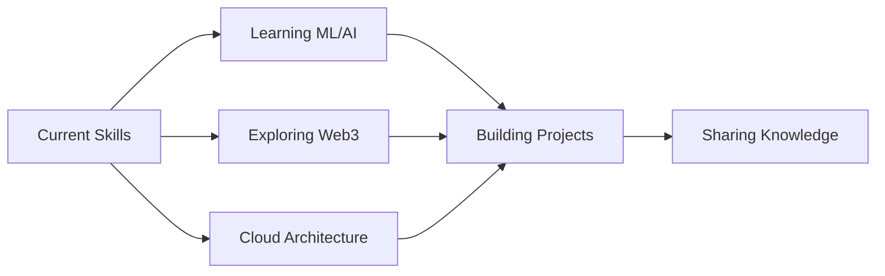

# 👋 Hello, I'm [Your Name]

<div align="center">
  
### 🚀 Full Stack Developer | 🎨 Creative Problem Solver | 🌟 Open Source Enthusiast

[](your-portfolio-url)
[](your-linkedin-url)
[](your-twitter-url)
[](mailto:your-email)

</div>

---

## 💫 About Me

```typescript
const developer = {
    name: "Your Name",
    location: "Your City, Country",
    currentFocus: "Building scalable web applications",
    learning: ["Machine Learning", "Cloud Architecture", "Web3"],
    hobbies: ["Photography", "Open Source", "Tech Writing"],
    funFact: "I debug with console.log() and I'm not ashamed"
};
```

I'm passionate about creating elegant solutions to complex problems. When I'm not coding, you'll find me contributing to open source, writing tech articles, or exploring the latest technologies.

---

## 🛠️ Tech Stack

### Languages


### Frontend


### Backend


### Database & Cloud


---

## 📊 GitHub Statistics

<div align="center">
  


</div>

---

## 🏆 Featured Projects

<table>
<tr>
<td width="50%">

### 🎯 Project Name One
A modern web application that does amazing things with cutting-edge technology.

**Tech:** React, Node.js, PostgreSQL

[](link-to-repo)
[](link-to-demo)

</td>
<td width="50%">

### 🚀 Project Name Two
An innovative solution for [problem domain] with real-time features.

**Tech:** Python, FastAPI, Docker

[](link-to-repo)
[](link-to-demo)

</td>
</tr>
</table>

---

## 📝 Latest Blog Posts

<!-- BLOG-POST-LIST:START -->
- 📌 [How I Built a Scalable Microservices Architecture](blog-link)
- 🔥 [10 JavaScript Tricks Every Developer Should Know](blog-link)
- 💡 [My Journey Learning TypeScript](blog-link)
- 🎨 [Building Beautiful UIs with Tailwind CSS](blog-link)
<!-- BLOG-POST-LIST:END -->

---

## 🌱 Current Learning Journey


```mermaid
graph LR
    A[Current Skills] --> B[Learning ML/AI]
    A --> C[Exploring Web3]
    A --> D[Cloud Architecture]
    B --> E[Building Projects]
    C --> E
    D --> E
    E --> F[Sharing Knowledge]
```

---

## 💬 Let's Connect!

I'm always open to interesting conversations and collaboration opportunities!

<div align="center">

### "Code is like humor. When you have to explain it, it's bad." – Cory House


**⭐️ From [YourUsername](https://github.com/yourusername) with 💙**

</div>
