# <div align="center">👋 Hi, I'm John Abner Garzon</div>

<div align="center">
  
### 💻 Junior Programmer • 🎨 UI/UX Enthusiast • 📊 Business Analytics Graduate

<br>

[](https://your-portfolio-link.com)
[](https://linkedin.com/in/johnabnergarzon)
[](mailto:garzonjohn769@gmail.com)

<br>


</div>

---

## 🚀 About Me


```typescript
const johnAbner = {
    location: "📍 Philippines",
    education: "🎓 BSIT - Business Analytics",
    role: "💼 Junior Developer",
    passion: "Building intelligent, data-driven systems",
    currentlyLearning: [
        "Data Analytics & Visualization",
        "Advanced UI/UX Principles",
        "Cloud Architecture"
    ],
    workExperience: [
        "CodeCollective IT Solutions (Intern)",
        "Department of Trade & Industry (Intern)"
    ],
    philosophy: "Great design starts with empathy 💡"
};
```

I'm passionate about creating **functional, beautiful, and user-centered applications** that solve real-world problems. My experience spans web development, system design, and data analytics—always with a focus on the end user.

<br clear="right"/>

---

## 🛠️ Technical Arsenal

<div align="center">

### Languages


### Frameworks & Libraries


### Databases & Tools


</div>

---

## 💼 Featured Projects

### 🌿 E-Wellness Web Application
> *Wellness platform promoting mental health through guided relaxation and mood tracking*

**🎯 Developed during internship at CodeCollective IT Solutions**

- ✅ Personalized breathing exercises and relaxation guides
- ✅ Interactive mood and stress tracking dashboard
- ✅ Daily wellness tips with smart reminders
- ✅ Fully responsive, modern UI/UX design

**Tech Stack:** `PHP` `MySQL` `JavaScript` `HTML/CSS`

---

### 🧾 DTI Finance Processing System
> *Automated finance management system streamlining departmental workflows*

**🎯 Developed during internship at Department of Trade and Industry**

- ✅ Digital request management with status tracking
- ✅ Multi-level approval workflow automation
- ✅ Automated financial reporting and analytics
- ✅ Secure document management system

**Tech Stack:** `PHP` `MySQL` `JavaScript` `HTML/CSS`

---

## 🎯 Core Competencies

<div align="center">

| 💻 Development | 🎨 Design | 📊 Analytics |
|:---:|:---:|:---:|
| Full-stack Web Development | UI/UX Design & Prototyping | Data Analysis & Visualization |
| RESTful API Integration | Responsive Design | Database Management |
| Version Control (Git) | User Research | Business Intelligence |
| Agile Methodology | Figma & Design Systems | Report Generation |

</div>

### 🏆 Professional Highlights

- 🌟 **Developed 2+ production-ready systems** during internships
- 💼 **Collaborated with government and private sectors** (DTI & CodeCollective)
- 🎓 **BSIT - Business Analytics Graduate** from SEAIT
- 🛠️ **Built full-stack applications** from concept to deployment
- 📈 **Focus on user-centered design** and data-driven solutions

---

## 🌱 Learning Roadmap

```mermaid
graph TD
    A[🎯 Current Focus] --> B[💻 Frontend Mastery]
    A --> C[🎨 UI/UX Design]
    A --> D[📊 Data Analytics]
    B --> E[⚛️ React & Next.js]
    C --> F[🧩 Design Systems]
    D --> G[🐍 Python & Visualization]
    E --> H[🚀 Portfolio Projects]
    F --> H
    G --> H
    H --> I[🌍 Open Source Contributions]
    I --> J[🌱 Professional Growth]

```



---

## 💡 What I'm Currently Exploring

- 📊 **Data Visualization** and reporting using **Power BI**  
- 🎨 **UI/UX Design Systems** — creating clean and user-friendly interfaces  
- 🚀 **Modern JavaScript Frameworks** (Vue, React) and best coding practices


---

## 🤝 Let's Collaborate!

I'm always excited to connect with fellow developers, designers, and tech enthusiasts. Whether you have a project idea, need help with development, or just want to chat about technology—feel free to reach out!

<div align="center">

### 💬 "The only way to do great work is to love what you do." — Steve Jobs

<br>

[](https://github.com/johnabnergarzon)


<br>

**⭐️ Made with 💙 by John Abner Garzon**

<sub>Open to opportunities • Available for freelance projects • Let's build something amazing together!</sub>

</div>
